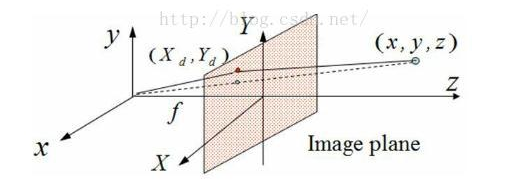
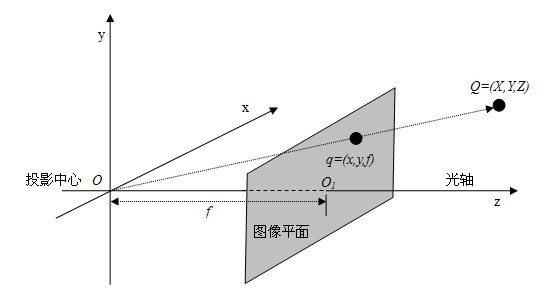
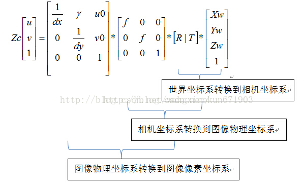

# 相机内参和外参

[TOC]

## 一：坐标系统

相机系统涉及的坐标：**像素坐标(u,v) -> 像平面坐标(x,y) -> 3D相机坐标(x~c~,y~c~,z~c~) -> 3D世界坐标(x~w~,y~w~,z~w~)** 。

- **相机外参：** 3D世界坐标到3D相机坐标的转换。和位置密切相关，基本上每次都要重新计算。
- **相机内参：** 3D相机坐标到像素坐标的转换。基本不变。

## 二：相机外参

外参和位置有关，包括：旋转矩阵 **R** 和平移矩阵 **T** 。简言之，笛卡尔坐标系下使用旋转和平行矩阵可以完成任意正交坐标基下向量的变换。

## 三：相机内参

### 3.1 3D相机坐标(x~c~,y~c~,z~c~) -> 像平面坐标(x,y) 

由相似三角形：
$$
f/z_{c}=x/x_{c}\\
f/z_{c}=y/y_{c}
$$
即：
$$
x=fx_{c}/z_{c}\\
y=fy_{c}/z_{c}
$$
使用齐次坐标表示：
$$
z_{c}*x^{'}
=
z_{c}
\begin{bmatrix}
x\\ 
y\\ 
1
\end{bmatrix}
=
\begin{bmatrix}
f & 0 & 0\\ 
0 & f & 0\\ 
0 & 0 & 1
\end{bmatrix}
\begin{bmatrix}
x_{c}\\ 
y_{c}\\ 
z_{c}
\end{bmatrix}
=M1*x_{c}^{'}
$$

### 3.2 像平面坐标(x,y) -> 像素坐标(u,v)

一般像平面坐标的原点在主轴上，而像素坐标一般选择左上角为原点。设像素坐标偏移为 $u_{0}*v_{0}$ 传感器尺寸为 $U*V(mm)$ ，最大分辨率为 $x_{max}*y_{max}$ 每个像素的物理尺寸为 $dx*dy (mm)$，那么:
$$
x/x_{max}=(u+u_{0})/U\\
y/y_{max}=(v+v_{0})/V
$$
即：
$$
u=xU/x_{max}-u_{0}=x/dx-u_{0}\\
v=yV/y_{max}-v_{0}=y/dy-v_{0}
$$
写成齐次坐标形式：
$$
\begin{bmatrix}
u\\ 
v\\ 
1
\end{bmatrix}
=
\begin{bmatrix}
\frac{1}{dx} & 0 & u_{0}\\ 
0 & \frac{1}{dy} & v_{0}\\ 
0 & 0 & 1
\end{bmatrix}
\begin{bmatrix}
x\\ 
y\\ 
1
\end{bmatrix}
=M2*x^{'}
$$

### 3.3 内参矩阵K

$$
K=M2*M1
=
\begin{bmatrix}
\frac{f}{dx} & 0 & u_{0}\\ 
0 & \frac{f}{dy} & v_{0}\\ 
0 & 0 & 1
\end{bmatrix}
$$

## 四：畸变

采用理想针孔模型，由于通过针孔的光线少，摄像机曝光太慢，在实际使用中均采用透镜，可以使图像生成迅速，但代价是引入了畸变。有两种畸变对投影图像影响较大： 径向畸变和切向畸变。

### 4.1 径向畸变

对某些透镜，光线在远离透镜中心的地方比靠近中心的地方更加弯曲，产生“筒形”或“鱼眼”现象，称为径向畸变。一般来讲，成像仪中心的径向畸变为0，越向边缘移动，畸变越严重。不过径向畸变可以通过下面的泰勒级数展开式来校正：
$$
x_{corrected}=x(1+k_{1}r^{2}+k_{2}r^{4}+k_{3}r^{6})\\
y_{corrected}=y(1+k_{1}r^{2}+k_{2}r^{4}+k_{3}r^{6})
$$
这里（x, y）是畸变点在成像仪上的原始位置，r为该点距离成像仪中心的距离，(x~corrected~ ，y~corrected~) 是校正后的新位置。

对于一般的摄像机校正，通常使用泰勒级数中的前两项k1和k2就够了；对畸变很大的摄像机，比如鱼眼透镜，可以使用第三径向畸变项k3。

###4.2 切向畸变

当成像仪被粘贴在摄像机的时候，会存在一定的误差，使得图像平面和透镜不完全平行，从而产生切向畸变。也就是说，如果一个矩形被投影到成像仪上时，可能会变成一个梯形。切向畸变可以通过如下公式来校正：
$$
x_{corrected}=x+[2p_{1}y+p_{2}(r^{2}+2x^{2})]\\
y_{corrected}=y+[2p_{2}x+p_{1}(r^{2}+2y^{2})]
$$
这里（x, y）是畸变点在成像仪上的原始位置，r为该点距离成像仪中心的距离，(x~corrected~ ，y~corrected~) 是校正后的新位置。

参考文档：

https://blog.csdn.net/yangdashi888/article/details/51356385

https://www.cnblogs.com/Jessica-jie/p/6596450.html

https://blog.csdn.net/a083614/article/details/78579163